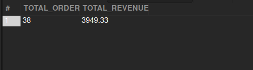

## BOPIS Orders Revenue (Last Year)

## Business Problem:
BOPIS (Buy Online, Pickup In Store) is a key retail strategy. Finance wants to know the revenue from BOPIS orders for the previous year.

## Fields to Retrieve:

```
TOTAL ORDERS
TOTAL REVENUE
```

## Solution :

```sql
select
	count(oh.order_id) as TOTAL_ORDER,
    sum(oh.grand_total) as TOTAL_REVENUE
from order_header oh
join order_item_ship_group oisg on oh.order_id = oisg.order_id
where oh.sales_channel_enum_id='web_sales_channel'
	and oisg.shipment_method_type_id='storepickup'
	and oh.status_id='order_completed'
	and oh.order_type_id='sales_order'
	and year(oh.order_date) = year(current_date)-1;
```


## Query Cost : 1369.88