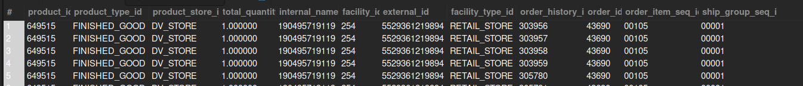

## Completed Orders in August 2023

## Business Problem:
After running similar reports for a previous month, you now need all completed orders in August 2023 for analysis.

## Fields to Retrieve:

```
PRODUCT_ID
PRODUCT_TYPE_ID
PRODUCT_STORE_ID
TOTAL_QUANTITY
INTERNAL_NAME
FACILITY_ID
EXTERNAL_ID
FACILITY_TYPE_ID
ORDER_HISTORY_ID
ORDER_ID
ORDER_ITEM_SEQ_ID
SHIP_GROUP_SEQ_ID
```

## Solution :

```sql
select
	p.product_id,
    p.product_type_id,
	oh.product_store_id,
    sum(oi.quantity) as total_quantity,
    p.internal_name,
    p.facility_id,
    oh.external_id,
    f.facility_type_id,
    ohi.order_history_id,
    oh.order_id,
    oi.order_item_seq_id,
    oi.ship_group_seq_id
from order_header oh
join order_item oi on oh.order_id = oi.order_id
join product p on oi.product_id = p.product_id
join facility f on p.facility_id = f.facility_id
join order_history ohi on oh.order_id = ohi.order_id
where oh.status_id = 'order_completed'
and oh.order_date between '2023-08-01 00:00:00' and '2023:08:31 23:59:59'
group by
	p.product_id,p.product_type_id,oh.product_store_id,p.facility_id,
    oh.external_id,f.facility_type_id,ohi.order_history_id,oh.order_id,
    oi.order_item_seq_id,oi.ship_group_seq_id
```



## Query Cost : 56990.51