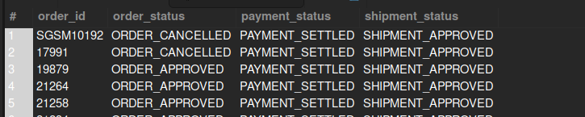

## Payment Captured but Not Shipped

## Business Problem:
Finance teams want to ensure revenue is recognized properly. If payment is captured but no shipment has occurred, it warrants further review.

## Fields to Retrieve:

```
ORDER_ID
ORDER_STATUS
PAYMENT_STATUS
SHIPMENT_STATUS
```

## Solution :

```sql
select
	oh.order_id,
    oh.status_id as order_status,
    opp.status_id as payment_status,
    s.status_id as shipment_status
from order_header oh
join order_payment_preference opp on oh.order_id = opp.order_id
join order_shipment os on oh.order_id = os.order_id
join shipment s on os.shipment_id = s.shipment_id
where opp.status_id='payment_settled'
	and s.status_id!='shipment_shipped';
```



## Query Cost : 44391.48