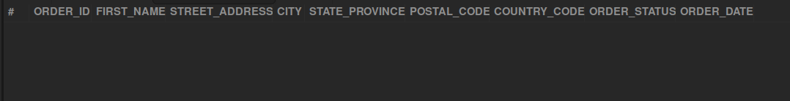

## Shipping Addresses for October 2023 Orders

## Business Problem:
Customer Service might need to verify addresses for orders placed or completed in October 2023. This helps ensure shipments are delivered correctly and prevents address-related issues.

## Fields to Retrieve:

```
ORDER_ID
PARTY_ID (Customer ID)
CUSTOMER_NAME (or FIRST_NAME / LAST_NAME)
STREET_ADDRESS
CITY
STATE_PROVINCE
POSTAL_CODE
COUNTRY_CODE
ORDER_STATUS
ORDER_DATE
```

## Solution :

```sql
select 
	oh.order_id as ORDER_ID,
    pe.first_name as FIRST_NAME,
    pa.address1 as STREET_ADDRESS,
    pa.city as CITY,
    pa.state_province_geo_id as STATE_PROVINCE,
    pa.postal_code as POSTAL_CODE,
    tn.country_code as COUNTRY_CODE,
    oh.status_id as ORDER_STATUS,
    oh.order_date as ORDER_DATE
from order_header oh
join order_role orl on oh.order_id = oh.order_id
join person pe on orl.party_id = pe.party_id
join order_contact_mech ocm on oh.order_id = ocm.order_id
join postal_address pa on ocm.contact_mech_id = pa.contact_mech_id
join telecom_number tn on ocm.contact_mech_id = tn.contact_mech_id
join order_status os on oh.order_id = os.order_id
where orl.role_type_id in ('ship_to_customer','placing_customer')
and oh.status_id in ('order_approved','order_completed')
and os.status_datetime between '2023-10-01 00:00:00' and '2023-10-31 23:59:59'
```

