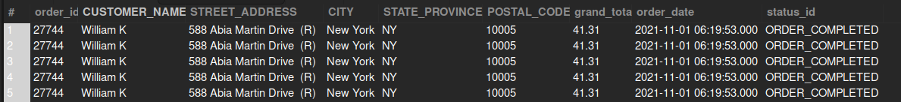

## Orders from New York

## Business Problem:
Companies often want region-specific analysis to plan local marketing, staffing, or promotions in certain areas—here, specifically, New York.

## Fields to Retrieve:

```
ORDER_ID
CUSTOMER_NAME
STREET_ADDRESS (or shipping address detail)
CITY
STATE_PROVINCE
POSTAL_CODE
TOTAL_AMOUNT
ORDER_DATE
ORDER_STATUS
```

## Solution :

```sql
select
	oh.order_id,
    concat(pe.first_name,' ',pe.last_name) as CUSTOMER_NAME,
    pa.address1 as STREET_ADDRESS,
    pa.city as CITY,
    pa.state_province_geo_id as STATE_PROVINCE,
    pa.postal_code as POSTAL_CODE,
    oh.grand_total,
    oh.order_date,
    oh.status_id
from order_header oh
join order_role orl on oh.order_id = orl.order_id
join person pe on orl.party_id = pe.party_id
join order_contact_mech ocm on oh.order_id = ocm.order_id
join contact_mech cm on ocm.contact_mech_id = cm.contact_mech_id
join postal_address pa on cm.contact_mech_id = pa.contact_mech_id and pa.state_province_geo_id='NY'
```



## Query Cost : 284341.37