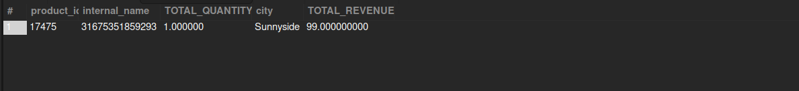

## Top-Selling Product in New York

## Business Problem:
Merchandising teams need to identify the best-selling product(s) in a specific region (New York) for targeted restocking or promotions.

## Fields to Retrieve:

```
PRODUCT_ID
INTERNAL_NAME
TOTAL_QUANTITY_SOLD
CITY / STATE (within New York region)
REVENUE (optionally, total sales amount)
```

```sql
select
	f.facility_id as FACILITY_ID,
    f.facility_name,
	count(oh.order_id) as TOTAL_ORDERS,
    sum(oh.grand_total) as TOTAL_REVENUE
from order_header oh
join facility f on oh.origin_facility_id = f.facility_id
where oh.status_id = 'ORDER_COMPLETED'
	and oh.order_date between '2024-01-01 00:00:00' and '2024-01-31 23:59:59'
group by oh.origin_facility_id,f.facility_name
```



## Query Cost : 114422.04