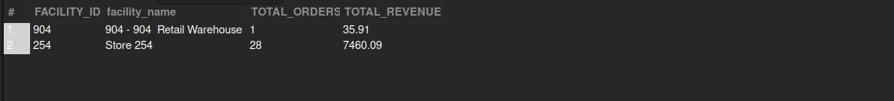

## Store-Specific (Facility-Wise) Revenue

## Business Problem:
Different physical or online stores (facilities) may have varying levels of performance. The business wants to compare revenue across facilities for sales planning and budgeting.

## Fields to Retrieve:

```
FACILITY_ID
FACILITY_NAME
TOTAL_ORDERS
TOTAL_REVENUE
DATE_RANGE
```

## Solution :

```sql
select
	f.facility_id as FACILITY_ID,
    f.facility_name,
	count(oh.order_id) as TOTAL_ORDERS,
    sum(oh.grand_total) as TOTAL_REVENUE
from order_header oh
join facility f on oh.origin_facility_id = f.facility_id
where oh.status_id = 'ORDER_COMPLETED'
	and oh.order_date between '2024-01-01 00:00:00' and '2024-01-31 23:59:59'
group by oh.origin_facility_id,f.facility_name
```



## Query Cost : 8003.74