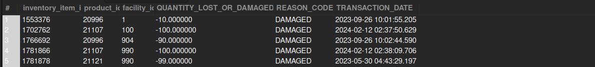

## Lost and Damaged Inventory

## Business Problem:
Warehouse managers need to track “shrinkage” such as lost or damaged inventory to reconcile physical vs. system counts.

## Fields to Retrieve:

```
INVENTORY_ITEM_ID
PRODUCT_ID
FACILITY_ID
QUANTITY_LOST_OR_DAMAGED
REASON_CODE (Lost, Damaged, Expired, etc.)
TRANSACTION_DATE
```

## Solution :

```sql
select
	iid.inventory_item_id,
    ii.product_id,
    ii.facility_id,
    iid.quantity_on_hand_diff as QUANTITY_LOST_OR_DAMAGED,
    iid.reason_enum_id as REASON_CODE,
    iid.effective_date as TRANSACTION_DATE
from inventory_item ii
join inventory_item_detail iid on ii.inventory_item_id = iid.inventory_item_id and iid.reason_enum_id in ('VAR_LOST','VAR_DAMAGED','DAMAGED')
where iid.quantity_on_hand_diff < 0 -- negative quantity means shrinkage
```



## Query Cost : 50762.50