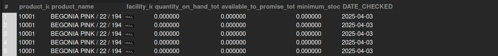

## Low Stock or Out of Stock Items Report

## Business Problem:
Avoiding out-of-stock situations is critical. This report flags items that have fallen below a certain reorder threshold or have zero available stock.

## Fields to Retrieve:

```
PRODUCT_ID
PRODUCT_NAME
FACILITY_ID
QOH (Quantity on Hand)
ATP (Available to Promise)
REORDER_THRESHOLD
DATE_CHECKED
```

## Solution :

```sql
select
	pr.product_id,
    pr.product_name,
    pr.facility_id,
    ii.quantity_on_hand_total,
    ii.available_to_promise_total,
    pf.minimum_stock,
    current_date() as DATE_CHECKED
from inventory_item ii
join product pr on ii.product_id = pr.product_id
join product_facility pf on ii.product_id = pf.product_id
where ii.quantity_on_hand_total < pf.minimum_stock
or ii.quantity_on_hand_total = 0
```



## Query Cost : 7554957.06