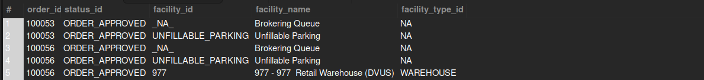

## Retrieve the Current Facility (Physical or Virtual) of Open Orders

## Business Problem:
The business wants to know where open orders are currently assigned, whether in a physical store or a virtual facility (e.g., a distribution center or online fulfillment location).

## Fields to Retrieve:

```
ORDER_ID
ORDER_STATUS
FACILITY_ID
FACILITY_NAME
FACILITY_TYPE_ID
```

## Solution :

```sql
select
	oh.order_id,
    oh.status_id,
    oisg.facility_id,
    f.facility_name,
    f.facility_type_id
from order_header oh
join order_item_ship_group oisg on oh.order_id = oisg.order_id
join facility f on oisg.facility_id = f.facility_id
where oh.status_id not in ('ORDER_COMPLETED','ORDER_CANCELLED')
```



## Query Cost : 11642584