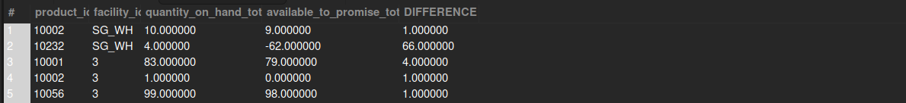

## Items Where QOH and ATP Differ

## Business Problem:
Sometimes the Quantity on Hand (QOH) doesn’t match the Available to Promise (ATP) due to pending orders, reservations, or data discrepancies. This needs review for accurate fulfillment planning.

## Fields to Retrieve:

```
PRODUCT_ID
FACILITY_ID
QOH (Quantity on Hand)
ATP (Available to Promise)
DIFFERENCE (QOH - ATP)
```

## Solution :

```sql
select
	ii.product_id,
    ii.facility_id,
    ii.quantity_on_hand_total,
    ii.available_to_promise_total,
    (ii.quantity_on_hand_total - ii.available_to_promise_total ) as DIFFERENCE
from inventory_item ii
where ii.quantity_on_hand_total != ii.available_to_promise_total
```



## Query Cost : 215063.61