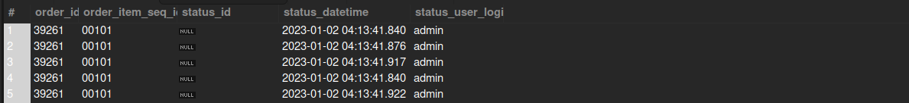

## Order Item Current Status Changed Date-Time

## Business Problem:
Operations teams need to audit when an order item’s status (e.g., from “Pending” to “Shipped”) was last changed, for shipment tracking or dispute resolution.

## Fields to Retrieve:

```
ORDER_ID
ORDER_ITEM_SEQ_ID
CURRENT_STATUS_ID
STATUS_CHANGE_DATETIME
CHANGED_BY
```

## Solution

```sql
select
	oi.order_id,
    oi.order_item_seq_id,
    oi.status_id,
    os.status_datetime,
    os.status_user_login
from order_item oi
join order_status os on oi.order_id = os.order_id
```



## Query Cost : 1391226.25