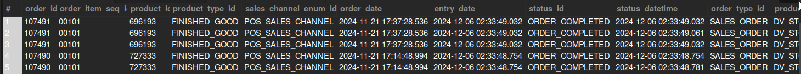

## Completed Sales Orders (Physical Items)

## Business Problem:
Merchants need to track only physical items (requiring shipping and fulfillment) for logistics and shipping-cost analysis.

## Fields to Retrieve:

```
ORDER_ID
ORDER_ITEM_SEQ_ID
PRODUCT_ID
PRODUCT_TYPE_ID
SALES_CHANNEL_ENUM_ID
ORDER_DATE
ENTRY_DATE
STATUS_ID
STATUS_DATETIME
ORDER_TYPE_ID
PRODUCT_STORE_ID
```

## Solution :

```sql

select
	oh.order_id,
    oi.order_item_seq_id,
    oi.product_id,
    pr.product_type_id,
    oh.sales_channel_enum_id,
    oh.order_date,
    oh.entry_date,
    oh.status_id,
    os.status_datetime,
    oh.order_type_id,
    oh.product_store_id
from order_header oh
join order_item oi on oh.order_id = oi.order_id
join product pr on oi.product_id = pr.product_id
join order_status os on oh.order_id = os.order_id
join product_type pt on pr.product_type_id = pt.product_type_id and pt.is_physical='Y'
where oh.status_id = 'order_completed'
	and oh.order_type_id = 'sales_order'
```



## Query Cost : 389399.76