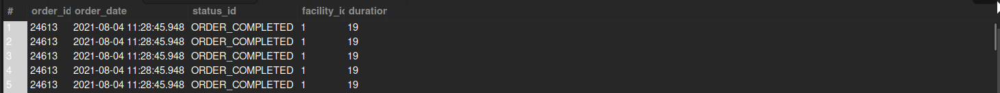

## Orders Without Picklist

## Business Problem:
A picklist is necessary for warehouse staff to gather items. Orders missing a picklist might be delayed and need attention.

## Fields to Retrieve:

```
ORDER_ID
ORDER_DATE
ORDER_STATUS
FACILITY_ID
DURATION (How long has the order been assigned at the facility)
```

## Solution :

```sql
select
	oh.order_id,
    oh.order_date,
    oh.status_id,
    oisg.facility_id,
    datediff(date(os.status_datetime) , date(oh.entry_date)) as duration
from order_header oh
join order_status os on oh.order_id = os.order_id and os.status_id = 'ORDER_COMPLETED'
join picklist pl on pl.facility_id = oh.origin_facility_id
join order_item_ship_group oisg on oh.order_id = oisg.order_id
where pl.status_id is not null
```



## Query Cost : 2657851.59