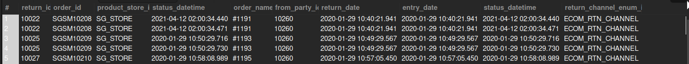

## Completed Return Items

## Business Problem:
Customer service and finance often need insights into returned items to manage refunds, replacements, and inventory restocking.

## Fields to Retrieve:

```
RETURN_ID
ORDER_ID
PRODUCT_STORE_ID
STATUS_DATETIME
ORDER_NAME
FROM_PARTY_ID
RETURN_DATE
ENTRY_DATE
RETURN_CHANNEL_ENUM_ID
```

## Solution

```sql
select
	rh.return_id,
    oh.order_id,
    oh.product_store_id,
    rs.status_datetime,
    oh.order_name,
    rh.from_party_id,
    rh.return_date,
    rh.entry_date,
    rs.status_datetime,
    rh.return_channel_enum_id
from return_header rh
join return_item ri on rh.return_id = ri.return_id and ri.status_id = 'return_completed'
join order_header oh on ri.order_id = oh.order_id
join return_status rs on rh.return_id = rs.return_id and rs.status_id = 'return_completed'
```



## Query Cost : 7622.34