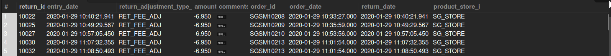

## Detailed Return Information

## Business Problem:
Certain teams need granular return data (reason, date, refund amount) for analyzing return rates, identifying recurring issues, or updating policies.

## Fields to Retrieve:

```
RETURN_ID
ENTRY_DATE
RETURN_ADJUSTMENT_TYPE_ID (refund type, store credit, etc.)
AMOUNT
COMMENTS
ORDER_ID
ORDER_DATE
RETURN_DATE
PRODUCT_STORE_ID
```

## Solution :

```sql
select
	rh.return_id,
    rh.entry_date,
    ra.return_adjustment_type_id,
    ra.amount,
    ra.comments,
    oh.order_id,
    oh.order_date,
    rh.return_date,
    oh.product_store_id
from return_header rh
join return_adjustment ra on rh.return_id = ra.return_id
join return_item ri on rh.return_id = ri.return_id
join order_header oh on ri.order_id = oh.order_id
```



## Query Cost : 5567.35